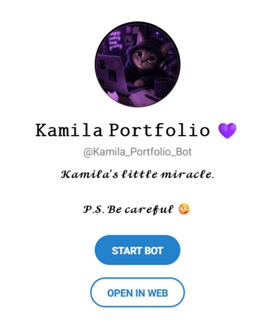
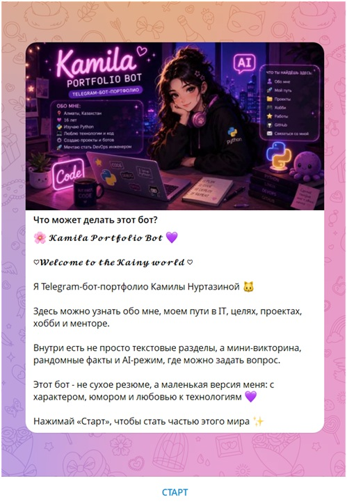
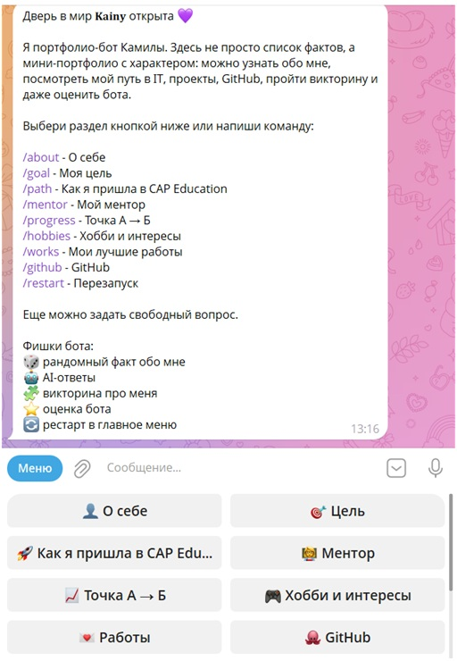
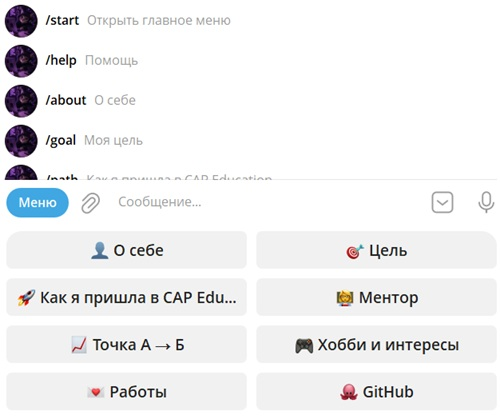
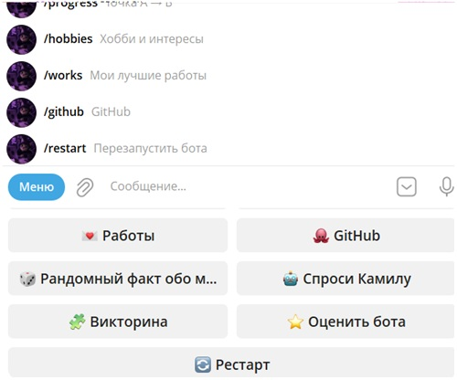

# 𝓚𝓪𝓶𝓲𝓵𝓪 𝓟𝓸𝓻𝓽𝓯𝓸𝓵𝓲𝓸 𝓑𝓸𝓽 💜

Telegram-бот-портфолио Камилы Нуртазиной для конкурса CAP Education.

Это не просто бот с текстом, а маленькая цифровая версия меня: с разделами, кнопками, викториной, AI-ответами, рандомными фактами и возможностью оценить бота.

## Что есть в боте

- 👤 О себе
- 🎯 Моя цель
- 🚀 Как я пришла в CAP Education
- 🧑‍🏫 Мой ментор
- 📈 Точка А → Б
- 🎮 Хобби и интересы
- 💌 Работы
- 🐙 GitHub

## Фишки проекта

- Удобное меню с кнопками
- Команды для каждого раздела
- Рандомный факт обо мне
- Мини-викторина про Камилу
- AI-режим, где можно задать вопрос
- Оценка бота
- Рестарт в главное меню
- Аргументы командной строки
- Регулярные выражения для поиска нужных разделов
- Бот размещен на PythonAnywhere и работает без включенного компьютера

## Технологии

- Python
- pyTelegramBotAPI
- Groq AI
- Regular Expressions
- argparse

## Как запустить

1. Установить зависимости:

`pip install -r requirements.txt`

2. Добавить переменные окружения:

`TELEGRAM_TOKEN=токен_из_BotFather`

`GROQ_API_KEY=ключ_из_Groq`

3. Проверить проект без подключения к Telegram:

`python bot.py --dry-run`

4. Запустить бота:

`python bot.py --token токен_из_BotFather --groq-key ключ_из_Groq`

## 🔗 Ссылки

- [Telegram-бот](https://t.me/Kamila_Portfolio_Bot)
- [GitHub-репозиторий](https://github.com/kainmylie/kainy)

## Скриншоты бота

### Профиль бота

### Преветственное сообщение

### Меню и навигация

## 💜 Автор

Камила Нуртазина  
Будущий DevOps-инженер, который когда-то боялась информатики, а теперь делает свои проекты на Python.
